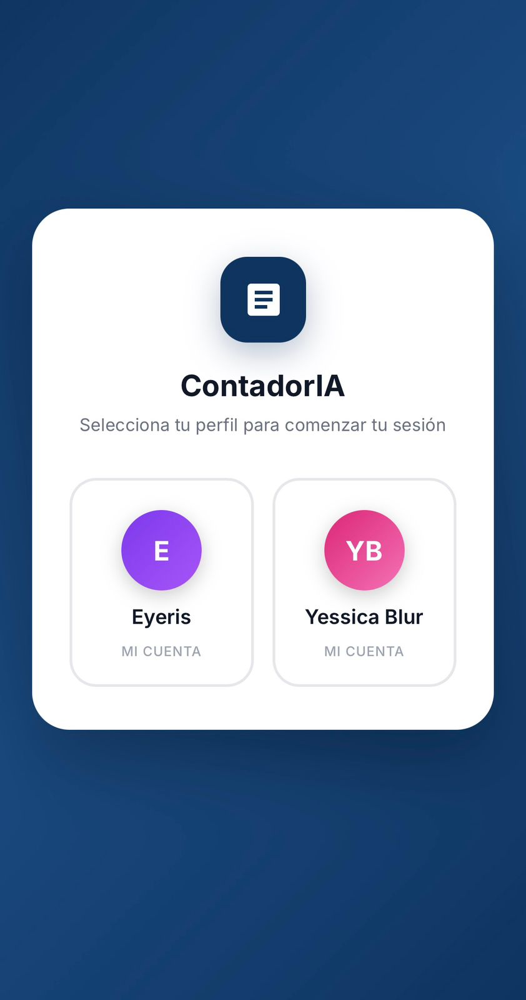
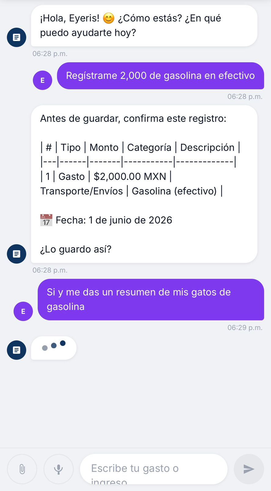

# Financial Operations Assistant

Financial Operations Assistant is a functional AI-powered Progressive Web App (PWA) designed to capture financial movements, organize administrative information and support decision-making.

The application has been deployed and tested as an installable mobile web app.

It supports conversational expense and income registration, document attachment and structured transaction capture.

## Business Problem

Many SMEs manage financial information through fragmented records, manual processes and disconnected documents.

This creates challenges such as:

- Manual expense registration
- Limited visibility into cash flow
- Delayed reporting
- Incomplete financial records
- Time-consuming document processing
- Difficulty consolidating income and expenses
- Reduced administrative control
- Slow decision-making

Financial Operations Assistant addresses these challenges through an AI-powered system that captures, structures and organizes financial information.

## Core Capabilities

The system can:

- Register income and expenses through a conversational interface
- Capture financial movements
- Attach receipts and supporting documents
- Extract relevant information from documents
- Classify transactions
- Organize administrative data
- Consolidate information into structured records
- Support periodic reporting
- Improve visibility into business finances
- Reduce manual administrative workload

## Product Status

```text
Functional MVP
→ deployed as a PWA
→ installable on mobile devices
→ tested in real usage
→ conversational transaction capture
→ structured financial registration
```

## Business Impact

The system is designed to improve measurable business outcomes, including:

- Reduced administrative workload
- Faster transaction registration
- Improved data quality
- Greater visibility into income and expenses
- Better financial control
- Faster reporting
- Improved decision-making
- Reduced manual errors

## Architecture

User interaction
→ Progressive Web App deployed on Netlify
→ Anthropic Claude Managed Agent
→ AI-powered interpretation and response generation
→ structured financial registration
→ reporting-oriented records
AI Runtime

The application uses Anthropic Claude as its AI runtime through Claude Managed Agents and the Claude API.

Claude processes conversational inputs, interprets financial information and generates structured outputs that support transaction registration and reporting.

The application interface is deployed as a Progressive Web App through Netlify, while the AI layer is powered by Anthropic Claude.

## Product Preview

### Mobile App



### Conversational Expense Capture


### Transaction History



### Financial Report


## Use Cases

This solution can be adapted to:

- SMEs
- Retail businesses
- Service-based businesses
- Hospitality and tourism companies
- Professional services
- Administrative teams
- Businesses seeking greater financial visibility

## Repository Structure

This public repository contains product documentation and sanitized materials only.

```text
financial-operations-assistant/
├── README.md
├── docs/
├── images/
└── workflows/
```

## Security Notice

Source code, production credentials, private endpoints and personal data are not included in this public repository.

## About GROVA

GROVA designs measurable, AI-powered growth systems for businesses across Latin America and the US Hispanic market.

**Growth Beyond Likes.**
